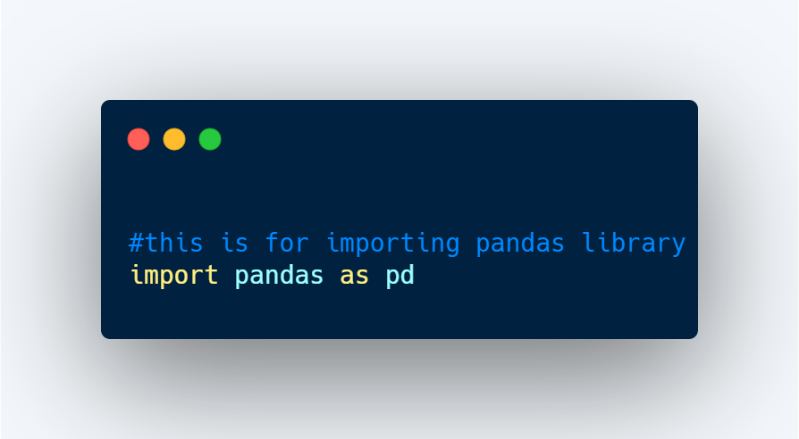
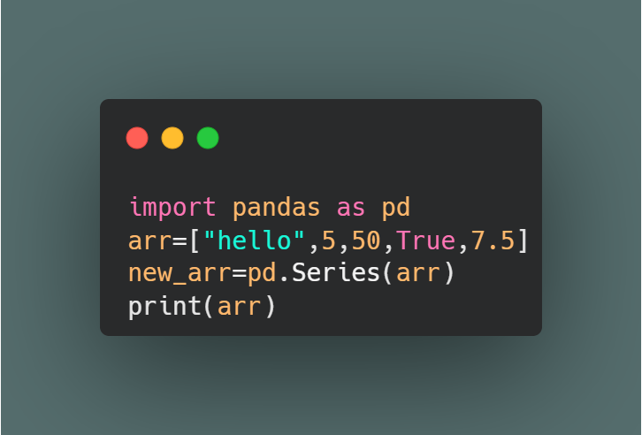
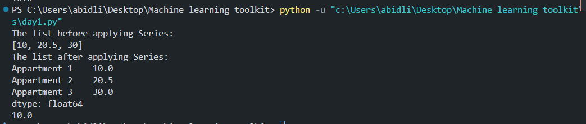

## Day 1: Learning about pandas

**Date:** JULY 11, 2026

### What I learned
- Importing the pandas library

- Using .Series(data)
- Using .Series(arr, index=[...])
- Using print(arr.loc[...])

### Code

### Example output

### Notes / Key Takeaways
- .Series(data) can be used when selecting a single feature. It is a one-dimensional labeled data structure.
- .Series(data, index=[...]) is used to set the indexes.
- .loc[index] is used to select a row or a value based on its index.
- The S in .Series(arr) is uppercase.