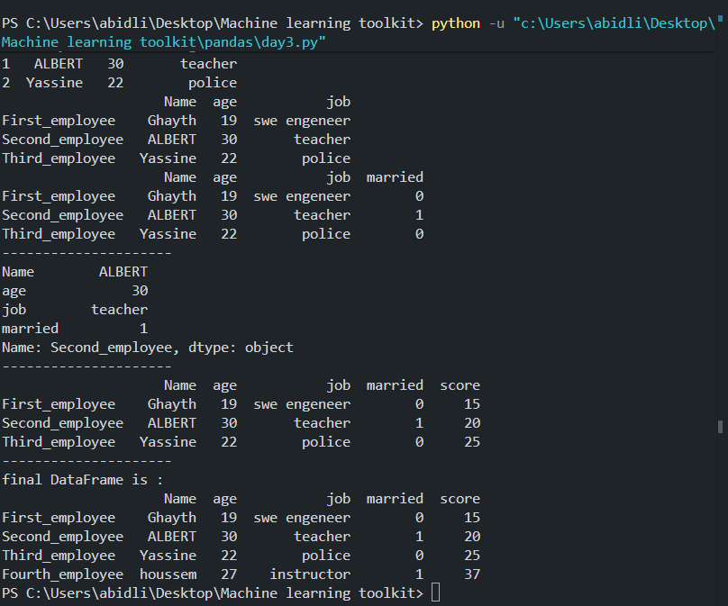
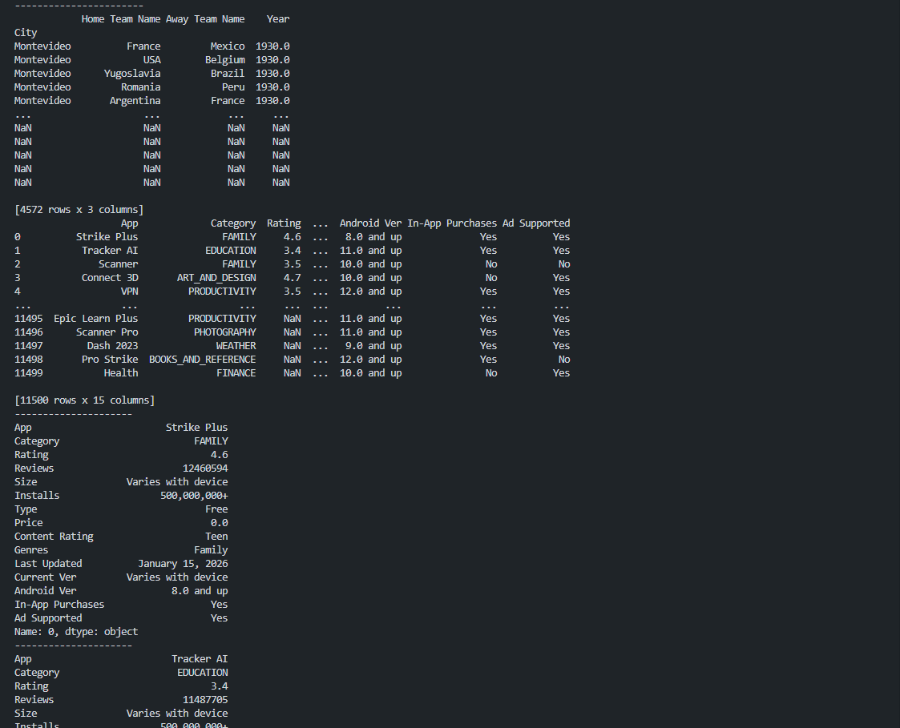

## Day 1 of Learning pandas

### What I learned

- Importing the `pandas` library
- Creating a `pd.Series(data)` object
- Creating a `pd.Series(data, index=[...])` object
- Selecting data with `.loc[...]`

### Code

```python
# 1-pd.Series(arr)
import pandas as pd
arr = [10, 20.5, 30]
new_arr = pd.Series(arr, index=["Appartment 1", "Appartment 2", "Appartment 3"])
print("The list before applying Series:")
print(arr)
print("The list after applying Series:")
print(new_arr)
print(new_arr.loc["Appartment 1"])
```

### Example_output


### Notes / Key takeaways

- `pd.Series(data)` creates a one-dimensional labeled data structure.
- `pd.Series(data, index=[...])` sets custom index labels.
- `.loc[index]` selects rows or values by index label.
- The `Series` constructor uses an uppercase `S`.
- to View some exercices and some other implementations non existant in the "master" branch you can visit revision branch via:
  --------------------- `git switch revision` -----------------------

---

## Day 2 of Learning pandas

***Date:*** July 12 2026

# What i Learned

## WHAT IS THE DIFFERENCE BTWEEN `.loc` and `.iloc` ?

- `.loc[]` selects by label(index_name),While `.iloc[]` selects by integer position(0,1,2,3,..........) regardless of what labels are.
- `Data[Data<200]` filters the Data Series and only gardes the elements that satisfy the condition between [...]
- `Data.index=[.......]` is the way to acces to the Series indexes (lables)
- A Python `dict` stores `key: value` pairs, where keys must be hashable (e.g. `str`, `int`, `tuple`) but not necessarily strings, and passing a `dict` into `pd.Series()` automatically uses its keys as the index.

### code

```python
import pandas as pd
Data = pd.Series(["A", "B", "C"], index=["index_1", "index_2", "index_3"])
# Displaying our Series
print(Data)
# Displaying an item of Series based on its index label
print(Data.loc["index_1"])
# Displaying an item of Series based on its position
print(Data.iloc[0])
# Modify the Series index
Data.index = [1, 2, 3]
print(Data[Data != "B"])

# Example with a Python dictionary
Dict = {"first": 15, "second": 20, "third": 40}
print(pd.Series(Dict))
print(pd.Series(Dict).loc["second"])
print(pd.Series(Dict).iloc[2])
print(pd.Series(Dict)[pd.Series(Dict) <= 20])
```

### Example_output :


### Notes / Key takeaways:

- `pd.Series(data, index=[...])` lets you assign custom labels to each item instead of relying on default 0,1,2 positions.
- `.loc[label]` selects an item by its **index label** (e.g. `Data.loc["index_1"]`).
- `.iloc[position]` selects an item by its **integer position**, regardless of what the labels are (position always starts at 0).
- You can **reassign the index** of an existing Series anytime with `Data.index = [...]`, as long as the new list has the same length as the Series.
- `Data[condition]` filters the Series, keeping only the items that satisfy the condition inside `[...]` (e.g. `Data[Data != "B"]`).
- Passing a `dict` into `pd.Series()` automatically uses the dict's **keys as the index** and its **values as the data** — no need to set `index=[...]` manually.
- `.loc[]`, `.iloc[]`, and filtering with `[...]` all work the same way whether the Series was built from a list or a dict.

---

## Day 3 of learning pandas:

***Date:*** July 13 2026

### What I learned:

-a `DataFrame` is a two dimentional labled data structure
-`pd.DataFrame` creates a DataFrame structure
-we can acces to a line by `Data.loc(Label_Name)` or by `Data.iloc(index)`
-we can add `a line` by creating a new line by creating a new `DataFrame` and then use `pd.concat([old DataFrame,New DataFrame])`
-we can add a column `Data[.......]=......`

### code:

```python
import pandas as pd
# creating a dictionary named Data
Data = {
    "Name": ["Ghayth", "ALBERT", "Yassine"],
    "age": [19, 30, 22],
    "job": ["swe engeneer", "teacher", "police"]
}
# convert a dictionary into a DataFrame
df = pd.DataFrame(Data)
print(df)
# changing the row indexes
df.index = ["First_employee", "Second_employee", "Third_employee"]
print(df)
# adding new column named married
df["married"] = [0, 1, 0]
print(df)
print("---------------------")
# printing the row that contains Second_employee label
print(df.loc["Second_employee"])
print("---------------------")
# adding a new column named Score
df["score"] = [15, 20, 25]
print(df)
# adding a new row with an index
New_Row = pd.DataFrame([{"Name": "houssem", "age": 27, "job": "instructor", "married": 1, "score": 37}], index=["Fourth_employee"])
df = pd.concat([df, New_Row])
print("---------------------")
print("final DataFrame is:")
print(df)
```

### Example_output



### Notes / Key takeaways:

- A `DataFrame` is a two-dimensional table made of rows and columns.
- `pd.DataFrame(data)` converts a dictionary into a DataFrame.
- You can rename row labels with `df.index = [...]` to make data access easier.
- New columns are created by assigning a list to a column name, such as `df["married"] = [...]`.
- `.loc["label"]` is used to select a row by its index label.
- To add a new row, create a one-row DataFrame and combine it with the existing one using `pd.concat([df, new_row])`.
- The new row must include the same column names as the original DataFrame, otherwise missing values will appear as `NaN`.

---

## Day 4 of Learning Pandas

***Date:*** July 14 2026

### What I Learned ?

-`pd.read_csv(r"file path")` reads a `csv` file and converts it into a DataFrame same as `pd.read_json()` (it reads a `Json` file )
-- **`index_col`**: Sets a column as the DataFrame's index instead of using the default numeric index.

### code:

```python
import pandas as pd
# How to read a csv file using pandas

df = pd.read_csv(r"C:\Users\abidli\Desktop\Machine learning toolkit\datasets\quebec_housing_sales_v2.csv")
print(df.to_string())
print("--------------------")
# How to read a json file using pandas

df1 = pd.read_json(r"C:\Users\abidli\Desktop\Machine learning toolkit\datasets\students.json")
print(df1)
print(df1["name"])
print("---------------------")
# Selection by multiple columns
print(df[["bedrooms", "bathrooms", "garage"]].to_string())
# Selection per row
print(df.loc[2])
print("---------------------")
print(df1.iloc[2])
print("----------------------")
import pandas as pd
Data = pd.read_csv(r"C:\Users\abidli\Desktop\Machine learning toolkit\assets\WorldCupMatches.csv", index_col="City")
print(Data)
print("----------------------")
print(Data.loc["Sao Paulo "])
print("----------------------")
print(Data["Stadium"])
print("-----------------------")
print(Data[["Home Team Name", "Away Team Name", "Year"]])
```

### Example_output:



### Notes/Key Takeaways:

- `pd.read_csv(r"file_path")` reads a CSV file and converts it into a DataFrame.
- `pd.read_json(r"file_path")` reads a JSON file and converts it into a DataFrame.
- **`index_col`** parameter sets a specific column as the DataFrame's index (e.g., `pd.read_csv(..., index_col="City")`).
- **Column Selection:**
  - Single column: `df["column_name"]` returns a Series.
  - Multiple columns: `df[["col1", "col2", "col3"]]` returns a DataFrame with only those columns.
- **Row Selection:**
  - `.loc[index_label]` selects a row by its index label.
  - `.iloc[position]` selects a row by its integer position (0, 1, 2, ...).
  - `.loc[start:end]` selects multiple rows by index label range.
  - `.iloc[start:end]` selects multiple rows by position range.
- **Combined Selection:** `df.loc[row_range, ["col1", "col2"]]` selects specific rows and columns together.
- `.to_string()` converts a DataFrame to a formatted string for better readability when printing.
- You can filter DataFrame columns using the same syntax: `df[["col1", "col2"]]` to get a subset of columns.
- **`.head(n)`** shows the first `n` rows of a DataFrame (default is 5). Example: `df.head(3)` shows the first 3 rows.
- **`.tail(n)`** shows the last `n` rows of a DataFrame (default is 5). Example: `df.tail(2)` shows the last 2 rows.
- `.head()` and `.tail()` are useful for quickly previewing large DataFrames without printing the entire dataset.

---

## Day 5 of Learning Pandas

***Date:*** July 15 2026

### What I Learned ?

- How to read a CSV file into a DataFrame with `pd.read_csv()`.
- How to display the whole DataFrame and preview it with `.head()` and `.tail()`.
- How to select a single column or multiple columns from a DataFrame.
- How to filter rows using conditions with `&` and `|`.
- How to summarize data using `.min()`, `.max()`, `.mean()`, `.sum()`, `.median()`, `.mode()`, `.count()`, and `.describe()`.
- How to group data with `.groupby()` and analyze grouped results.

### code:

```python
import pandas as pd
# Revision of day 4 and dataset analysis

df = pd.read_csv(r"C:\Users\abidli\Desktop\Machine learning toolkit\datasets\genai_llm_usage_dataset_1000.csv")
print(df)
print(df.loc[1])
print("-------------------")
print(df.iloc[2])
print("--------------------")
print(df["model_name"])
print("--------------------")
print(df.head())
print("---------------------")
print(df.head(8))
print("---------------------")
print(df.tail(10))
print(df.loc[[5, 7, 10]])
print("----------------------")
print(df.loc[15:20])
print("------------------------")
print(df[["model_name", "successful_response", "prompt_length"]])
print("------------------------")
print(df.loc[2:15, ["model_name", "task_type", "latency_sec"]])
print("------------------------")
# filtering based on a condition
print(df[(df["successful_response"] == 1) & (df["application_domain"] == "Coding")])
print("--------------------------")
print(df[(df["application_domain"] == "coding") | (df["application_domain"] == "Education")])
print(df.min(numeric_only=True))
print(df.max(numeric_only=True))
print(df.mean(numeric_only=True))
print(df.sum(numeric_only=True))
print(df.median(numeric_only=True))
print(df.mode())
print(df.count(numeric_only=True))
```

### Example_output:


### Notes / Key takeaways:

- `pd.read_csv()` is used to load data from a CSV file into a DataFrame.
- `.head()` and `.tail()` help you quickly inspect the beginning and end of a dataset.
- Conditional filtering can combine multiple rules with `&` for AND and `|` for OR.
- `.describe()` provides useful summary statistics for a DataFrame or a specific column.
- `.groupby()` helps organize data into groups so you can calculate statistics for each group.

---

## Day 6 of Learning Pandas

***Date:*** July 16 2026

### What is new in Day 6

- Dropping an unnecessary column with `.drop(columns=[...])`.
- Removing rows that contain missing values in specific columns with `.dropna(subset=[...])`.
- Filling missing values with the most common value using `.fillna(...)`.
- Standardizing text values with `.replace({...})`.
- Converting text to lowercase with `.str.lower()`.
- Removing duplicate rows with `.drop_duplicates()`.

### code:

```python
import pandas as pd
# Day 6: Data cleaning and preprocessing

df = pd.read_csv(r"C:\Users\abidli\Desktop\Machine learning toolkit\datasets\indian_overseas_migration_dataset.csv")
print(df.to_string())
print("-------------------------")
print(df.loc[0])
print("-------------------------")
print(df.iloc[2])
print("-------------------------")
print(df.loc[[2, 3, 5]])
print("-------------------------")
print(df.loc[8:12])
print("-------------------------")
print(df.head())
print("--------------------------")
print(df.tail())
print("--------------------------")
print(df["Destination_Country"])
print("--------------------------")
print(df[["Destination_Country", "Value", "Source_URL"]])
print("---------------------------")
print(df.loc[40:45, ["Destination_Country", "Region", "Year"]])
print("---------------------------")
print(df.mean(numeric_only=True))
print("----------------------------")
print(df.count())
print("----------------------------")
print(df.min(numeric_only=True))
print("---------------------------")
print(df.max(numeric_only=True))
print("----------------------------")
df = pd.read_csv(r"C:\Users\abidli\Desktop\Machine learning toolkit\datasets\quebec_housing_sales_v2.csv")
print(df["bedrooms"].median())
print(df["bedrooms"].sum())
print(df["bedrooms"].min())
print(df["bedrooms"].max())
print(df["bedrooms"].mode())
print(df["bedrooms"].count())
print("--------------------------")
print(df["bedrooms"].describe())
print("--------------------------")
New_groups = df.groupby("city")
print(New_groups.sum())
print("---------------------------")
print(New_groups["living_area_sqft"].median())
print("-----------------------------")
print(New_groups.count())
print("----------------------------")
print(New_groups["living_area_sqft"].mean())
``` 

### Example_output:


### Notes / Key takeaways:

- Day 6 introduces data cleaning and preparation steps that were not covered in the earlier days.
- `.drop(columns=[...])` removes columns that are no longer needed.
- `.dropna(subset=[...])` removes rows with missing values in selected columns.
- `.fillna({...})` replaces missing values with useful default values.
- `.replace({...})` helps normalize categories and labels.
- `.str.lower()` makes text values consistent.
- `.drop_duplicates()` removes repeated rows from the dataset.

---

## Day 7 of Learning Pandas

***Date:*** July 17 2026

### What I learned

- Reading data from a CSV using `pd.read_csv()`.
- Detecting and removing duplicate rows with `.drop_duplicates()`.
- Dropping unnecessary columns with `.drop(columns=[...])`.
- Converting all column names to lowercase with `df.columns = df.columns.str.lower()`.
- Removing rows with missing values using `.dropna()`.
- Replacing boolean values with numeric values using `.replace({True: 1, False: 0})`.
- Cleaning text fields by removing characters like `$` and `,` with `.str.replace()`.
- Saving the cleaned dataset to a new CSV file with `.to_csv()`.

### code:

```python
import pandas as pd
df = pd.read_csv(r"C:\Users\abidli\Desktop\Machine learning toolkit\datasets\Airbnb_Open_Data.csv")
print(df.duplicated().sum())
df = df.drop_duplicates()
df = df.drop(columns=['reviews per month', 'review rate number',
       'calculated host listings count', 'availability 365', 'house_rules',
       'license'])
print(df.info())
df.columns = df.columns.str.lower()
print(df.columns)
print(df.isna().sum())
df = df.drop(columns='last review')
print(df.columns)
df = df.dropna()
print(df.isna().sum())
df["instant_bookable"] = df["instant_bookable"].replace({
    True: 1,
    False: 0
})
print(df["instant_bookable"].to_string())
df[["price", "service fee"]] = df[["price", "service fee"]].apply(lambda col: col.str.replace("$", ""))
df[["price", "service fee"]] = df[["price", "service fee"]].apply(lambda col: col.str.replace(",", ""))
print("\n ", df[["price", "service fee"]])
print(df.columns)
df.to_csv("Clean Dataset.csv")
```

### Notes / Key takeaways:

- Day 7 focuses on data cleaning and preparing a dataset for analysis.
- `.drop_duplicates()` removes duplicate rows from the dataset.
- `.drop(columns=[...])` removes irrelevant or unwanted columns.
- `df.columns = df.columns.str.lower()` standardizes column names to lowercase.
- `.dropna()` removes rows with missing values to ensure cleaner data.
- `.replace({True: 1, False: 0})` converts boolean values to numeric format.
- `.str.replace("$", "")` and `.str.replace(",", "")` clean numeric strings for later numeric conversion.
- `.to_csv("Clean Dataset.csv")` saves the cleaned data to a new file.

---

## Day 8 of Learning Pandas

***Date:*** July 18 2026

### What I learned

- Reading a CSV file into a DataFrame using `pd.read_csv()`.
- Dropping duplicate rows with `.drop_duplicates()`.
- Normalizing column names with `.str.lower()`, `.str.strip()`, and `.str.replace()`.
- Filling missing values with mode and median values using `.fillna({...})`.
- Dropping rows with missing values in a specific column using `.dropna(subset=...)`.
- Cleaning text columns using `.str.strip()` and `.str.lower()`.
- Removing unwanted punctuation from string values with `.str.replace()`.
- Saving the cleaned DataFrame to a new CSV file with `.to_csv(..., index=False)`.

### code:

```python
import pandas as pd
df = pd.read_csv(r"C:\Users\abidli\Desktop\Machine learning toolkit\datasets\Bengaluru_House_Data.csv")
df = df.drop_duplicates()
df.columns = df.columns.str.lower()
df.columns = df.columns.str.strip()
df.columns = df.columns.str.replace("_", " ")
print(df.columns)
df = df.fillna({
    "area type": df["area type"].mode()[0],
    "availability": df["availability"].mode()[0],
    "size": df["size"].mode()[0],
    "society": df["society"].mode()[0],
    "bath": df["bath"].median(),
    "balcony": df["balcony"].median(),
    "price": df["price"].median()
})
print(df.dtypes)
df = df.drop_duplicates()
df = df.dropna(subset=["location"])
df["area type"] = df["area type"].str.strip()
df["availability"] = df["availability"].str.strip()
df["location"] = df["location"].str.strip()
df["size"] = df["size"].str.strip()
df["society"] = df["society"].str.strip()
df["total sqft"] = df["total sqft"].str.strip()
df["area type"] = df["area type"].str.lower()
df["area type"] = df["area type"].str.replace("-", " ")
df["availability"] = df["availability"].str.lower()
df["availability"] = df["availability"].str.replace("-", " ")
df["location"] = df["location"].str.lower()
df["location"] = df["location"].str.replace("-", " ")
df["society"] = df["society"].str.lower()
df.to_csv("New_ FINAL_cleaned_dataset about bengaluru House Data.CSV", index=False)
print("-----------")
```

### Notes / Key takeaways:

- Day 8 continues data cleaning with missing value imputation and text normalization.
- `.drop_duplicates()` removes repeated rows before and after cleaning.
- `.str.lower()`, `.str.strip()`, and `.str.replace()` standardize column names and string values.
- `.fillna({...})` fills missing values using the most common or median values for each column.
- `.dropna(subset=["location"])` removes rows that still lack location data.
- Cleaning string columns prepares text for consistent analysis.
- `.to_csv(..., index=False)` saves the final cleaned dataset without adding a new index column.
### My journey
This `pandas` journey has been a rewarding transformation from messy raw tables to clean, analysis-ready datasets. By removing duplicates with `.drop_duplicates()`, normalizing column names with `.str.lower()`, `.str.strip()`, and `.str.replace()`, filling gaps with `.fillna(...)`, and refining text values, I learned how powerful data cleaning can be. A guided video tutorial helped turn each step into a clear lesson, making this experience both practical and inspiring.

All the code and the exercises are taken from this tutorial:

[](https://youtu.be/VXtjG_GzO7Q?si=y6AGJ8ANheLDQe_Y)

