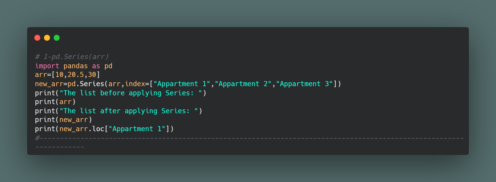
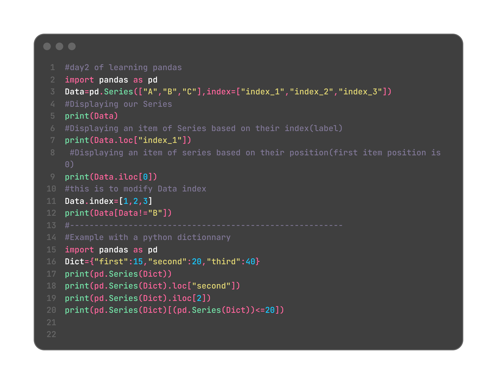
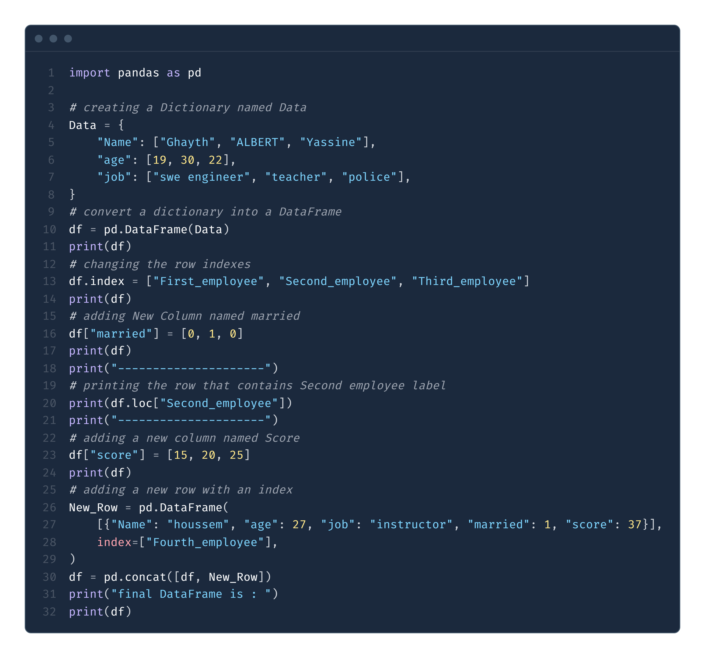
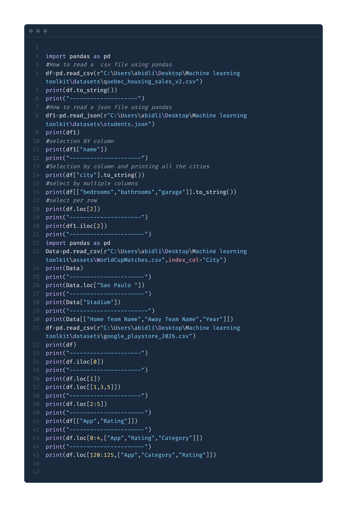
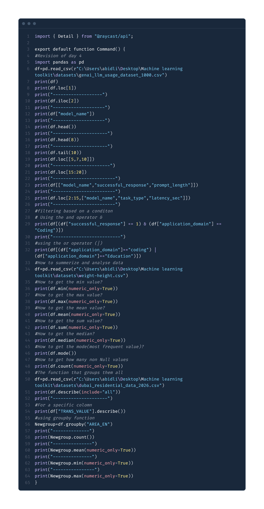
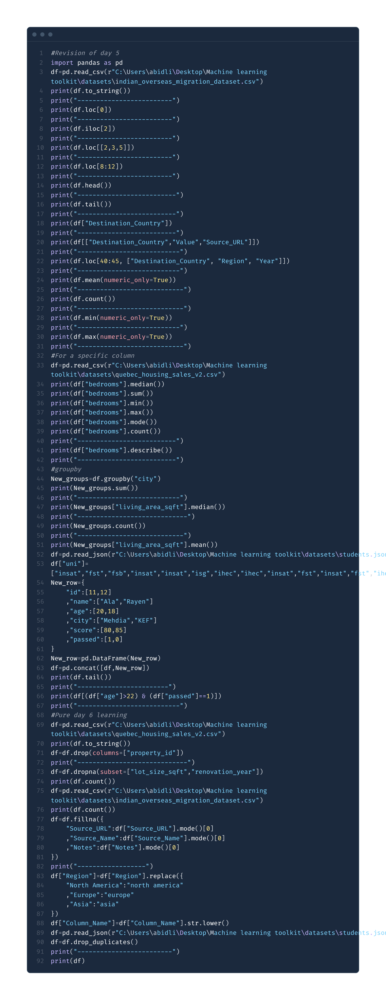

## Day 1 of Learning pandas
***Date:*** July 11 2026

### What I learned
- Importing the `pandas` library
- Creating a `pd.Series(data)` object
- Creating a `pd.Series(data, index=[...])` object
- Selecting data with `.loc[...]`

### Code

### Example_output

### Notes / Key takeaways
- `pd.Series(data)` creates a one-dimensional labeled data structure.
- `pd.Series(data, index=[...])` sets custom index labels.
- `.loc[index]` selects rows or values by index label.
- The `Series` constructor uses an uppercase `S`.
-  to View some exercices and some other implementations non existant in the "master" branch you can visit revision branch via:
--------------------- `git switch revision` ----------------------- 

---

## Day 2 of Learning pandas
***Date:*** July 12 2026
# What i Learned 
## WHAT IS THE DIFFERENCE BTWEEN `.loc` and `.iloc` ?
- `.loc[]` selects by label(index_name),While `.iloc[]` selects by integer position(0,1,2,3,..........) regardless of what labels are.
- `Data[Data<200]` filters the Data Series and only gardes the elements that satisfy the condition between [...]
- `Data.index=[.......]` is the way to acces to the Series indexes (lables)
- A Python `dict` stores `key: value` pairs, where keys must be hashable (e.g. `str`, `int`, `tuple`) but not necessarily strings, and passing a `dict` into `pd.Series()` automatically uses its keys as the index.
### code

### Example_output :

### Notes / Key takeaways:
- `pd.Series(data, index=[...])` lets you assign custom labels to each item instead of relying on default 0,1,2 positions.
- `.loc[label]` selects an item by its **index label** (e.g. `Data.loc["index_1"]`).
- `.iloc[position]` selects an item by its **integer position**, regardless of what the labels are (position always starts at 0).
- You can **reassign the index** of an existing Series anytime with `Data.index = [...]`, as long as the new list has the same length as the Series.
- `Data[condition]` filters the Series, keeping only the items that satisfy the condition inside `[...]` (e.g. `Data[Data != "B"]`).
- Passing a `dict` into `pd.Series()` automatically uses the dict's **keys as the index** and its **values as the data** — no need to set `index=[...]` manually.
- `.loc[]`, `.iloc[]`, and filtering with `[...]` all work the same way whether the Series was built from a list or a dict.

---

## Day 3 of learning pandas:
***Date:*** July 13 2026
### What I learned:
-a `DataFrame` is a two dimentional labled data structure
-`pd.DataFrame` creates a DataFrame structure 
-we can acces to a line by `Data.loc(Label_Name)` or by `Data.iloc(index)`
-we can add `a line` by creating a new line by creating a new `DataFrame` and then use `pd.concat([old DataFrame,New DataFrame])`
-we can add a column `Data[.......]=......`
### code:

### Example_output

### Notes / Key takeaways:
- A `DataFrame` is a two-dimensional table made of rows and columns.
- `pd.DataFrame(data)` converts a dictionary into a DataFrame.
- You can rename row labels with `df.index = [...]` to make data access easier.
- New columns are created by assigning a list to a column name, such as `df["married"] = [...]`.
- `.loc["label"]` is used to select a row by its index label.
- To add a new row, create a one-row DataFrame and combine it with the existing one using `pd.concat([df, new_row])`.
- The new row must include the same column names as the original DataFrame, otherwise missing values will appear as `NaN`.

---

## Day 4 of Learning Pandas
***Date:*** July 14 2026
### What I Learned ?
-`pd.read_csv(r"file path")` reads a `csv` file and converts it into a DataFrame same as `pd.read_json()` (it reads a `Json` file )
-- **`index_col`**: Sets a column as the DataFrame's index instead of using the default numeric index.
### code:

### Example_output:

### Notes/Key Takeaways:
- `pd.read_csv(r"file_path")` reads a CSV file and converts it into a DataFrame.
- `pd.read_json(r"file_path")` reads a JSON file and converts it into a DataFrame.
- **`index_col`** parameter sets a specific column as the DataFrame's index (e.g., `pd.read_csv(..., index_col="City")`).
- **Column Selection:**
  - Single column: `df["column_name"]` returns a Series.
  - Multiple columns: `df[["col1", "col2", "col3"]]` returns a DataFrame with only those columns.
- **Row Selection:**
  - `.loc[index_label]` selects a row by its index label.
  - `.iloc[position]` selects a row by its integer position (0, 1, 2, ...).
  - `.loc[start:end]` selects multiple rows by index label range.
  - `.iloc[start:end]` selects multiple rows by position range.
- **Combined Selection:** `df.loc[row_range, ["col1", "col2"]]` selects specific rows and columns together.
- `.to_string()` converts a DataFrame to a formatted string for better readability when printing.
- You can filter DataFrame columns using the same syntax: `df[["col1", "col2"]]` to get a subset of columns.
- **`.head(n)`** shows the first `n` rows of a DataFrame (default is 5). Example: `df.head(3)` shows the first 3 rows.
- **`.tail(n)`** shows the last `n` rows of a DataFrame (default is 5). Example: `df.tail(2)` shows the last 2 rows.
- `.head()` and `.tail()` are useful for quickly previewing large DataFrames without printing the entire dataset.

---

## Day 5 of Learning Pandas
***Date:*** July 15 2026

### What I Learned ?
- How to read a CSV file into a DataFrame with `pd.read_csv()`.
- How to display the whole DataFrame and preview it with `.head()` and `.tail()`.
- How to select a single column or multiple columns from a DataFrame.
- How to filter rows using conditions with `&` and `|`.
- How to summarize data using `.min()`, `.max()`, `.mean()`, `.sum()`, `.median()`, `.mode()`, `.count()`, and `.describe()`.
- How to group data with `.groupby()` and analyze grouped results.

### code:

### Example_output:

### Notes / Key takeaways:
- `pd.read_csv()` is used to load data from a CSV file into a DataFrame.
- `.head()` and `.tail()` help you quickly inspect the beginning and end of a dataset.
- Conditional filtering can combine multiple rules with `&` for AND and `|` for OR.
- `.describe()` provides useful summary statistics for a DataFrame or a specific column.
- `.groupby()` helps organize data into groups so you can calculate statistics for each group.

---

## Day 6 of Learning Pandas
***Date:*** July 16 2026

### What is new in Day 6
- Dropping an unnecessary column with `.drop(columns=[...])`.
- Removing rows that contain missing values in specific columns with `.dropna(subset=[...])`.
- Filling missing values with the most common value using `.fillna(...)`.
- Standardizing text values with `.replace({...})`.
- Converting text to lowercase with `.str.lower()`.
- Removing duplicate rows with `.drop_duplicates()`.

### code:

### Example_output:

### Notes / Key takeaways:
- Day 6 introduces data cleaning and preparation steps that were not covered in the earlier days.
- `.drop(columns=[...])` removes columns that are no longer needed.
- `.dropna(subset=[...])` removes rows with missing values in selected columns.
- `.fillna({...})` replaces missing values with useful default values.
- `.replace({...})` helps normalize categories and labels.
- `.str.lower()` makes text values consistent.
- `.drop_duplicates()` removes repeated rows from the dataset.
